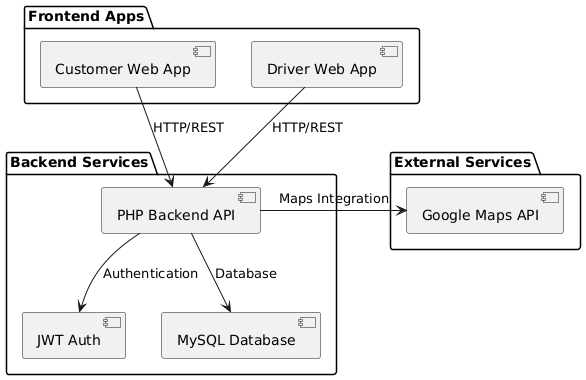
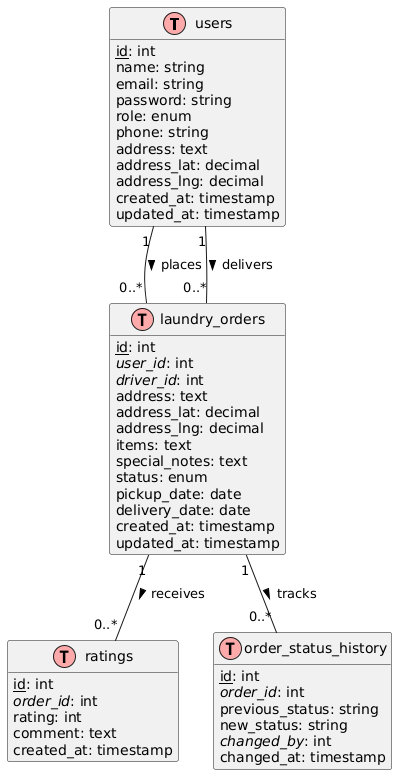
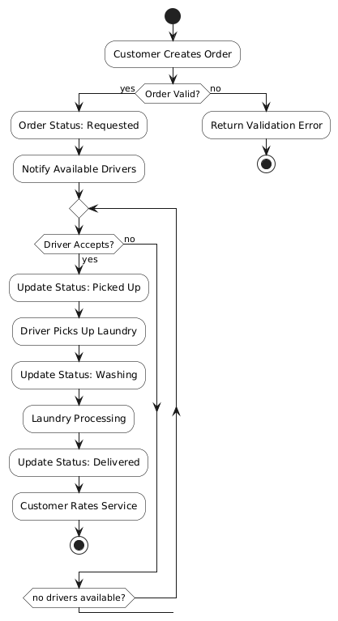

# 🚀 Door2Dry - Smart Laundry Pickup & Delivery System
## 📚 Technical Documentation & Installation Guide

---

## 📋 Table of Contents
1. [🎯 Introduction](#introduction)
2. [🏗️ System Architecture](#system-architecture)
3. [⚙️ Backend Application](#backend-application)
4. [🔌 API Documentation](#api-documentation)
5. [🔒 Security Implementation](#security-implementation)
6. [💻 Frontend Applications](#frontend-applications)
7. [🗄️ Database Design](#database-design)
8. [🔄 Business Logic and Data Validation](#business-logic-and-data-validation)
9. [📥 Installation Guide](#installation-guide)

---

## 🎯 Introduction

### Project Overview
Door2Dry is an innovative laundry service management system that connects customers with delivery drivers through a user-friendly platform. The system streamlines the process of laundry pickup and delivery, making laundry services more accessible and efficient.

### Commercial Value
The project addresses several key market needs:
- 📈 Growing demand for on-demand laundry services
- 🚚 Need for efficient delivery tracking and management
- 💡 Market gap in digital transformation of traditional laundry services
- 🤳 Increasing preference for contactless service delivery

> Integration with Google Maps API provides real-time location tracking and route optimization, enhancing both customer experience and operational efficiency.

---

## 🏗️ System Architecture

### High-Level Diagram
The system follows a distributed architecture with clear separation of concerns:



### Diagram Explanation
The system architecture diagram illustrates the key components and their interactions:

#### 1. Frontend Layer 🖥️
- Customer Web App: Interface for customers to place and track orders
- Driver Web App: Interface for drivers to manage deliveries
- Both apps communicate with the backend via HTTP/REST protocols

#### 2. Backend Services ⚡
- PHP Backend API: Central component handling all business logic and requests
- JWT Auth: Manages user authentication and session security
- MySQL Database: Persistent storage for all system data

#### 3. External Services 🌐
- Google Maps API: Provides location services and route optimization

#### 4. Key Interactions 🔄
- Frontend → API: HTTP/REST calls for all operations
- API → Auth: Session validation and token management
- API → Database: Data persistence and retrieval
- API → Maps: Location services integration

---

## ⚙️ Backend Application

### Technology Stack
- **Language**: PHP 7.4+
- **Database**: MySQL 5.7+
- **Authentication**: JWT (JSON Web Tokens)
- **External Services**: Google Maps API
- **Security**: ARGON2ID password hashing, CSRF protection

---

## 🔌 API Documentation

### Initial Login information
#### Driver Portal
- Email: driver@door2dry.com
- Password: driver1@123

### Base URL
All API endpoints are relative to your base URL. For example: `https://your-domain.com/api/`

### Authentication
The API uses session-based authentication. Most endpoints require users to be logged in.

### Response Format
All responses are in JSON format and include at least:
- `success`: boolean indicating if the request was successful
- `message` or `error`: string providing additional information
- Additional data specific to each endpoint

### Common HTTP Status Codes
- 200: Success
- 201: Created
- 400: Bad Request
- 401: Unauthorized
- 403: Forbidden
- 404: Not Found
- 405: Method Not Allowed
- 409: Conflict
- 500: Internal Server Error

### Authentication Endpoints

#### Register User
Create a new user account.

**Endpoint:** `POST /register.php`

**Request Body:**
```json
{
    "name": "string",
    "email": "string",
    "password": "string",
    "role": "customer|driver",
    "phone": "string (optional)",
    "address": "string (optional)",
    "address_lat": "float (optional)",
    "address_lng": "float (optional)"
}
```

**Validation:**
- Email must be valid format
- Password must be at least 6 characters
- Role must be either "customer" or "driver"

**Response (201):**
```json
{
    "success": true,
    "message": "Registration successful",
    "user": {
        "id": "integer",
        "name": "string",
        "email": "string",
        "role": "string"
    }
}
```

#### Login
Authenticate a user and create a session.

**Endpoint:** `POST /login.php`

**Request Body:**
```json
{
    "email": "string",
    "password": "string"
}
```

**Response (200):**
```json
{
    "success": true,
    "message": "Login successful",
    "user": {
        "id": "integer",
        "name": "string",
        "email": "string",
        "role": "string"
    }
}
```

#### Logout
End the current user session.

**Endpoint:** `POST /logout.php`

**Response (200):**
```json
{
    "success": true,
    "message": "Logout successful"
}
```

### Order Management Endpoints

#### Create Order
Create a new laundry order (Customer only).

**Endpoint:** `POST /create_order.php`

**Authentication Required:** Yes
**Role Required:** Customer

**Request Body:**
```json
{
    "address": "string",
    "items": "string",
    "special_notes": "string (optional)",
    "pickup_date": "YYYY-MM-DD (optional)",
    "pickup_time": "HH:MM (optional)",
    "address_lat": "float (optional)",
    "address_lng": "float (optional)"
}
```

**Response (201):**
```json
{
    "success": true,
    "message": "Order created successfully",
    "order": {
        "id": "integer",
        "address": "string",
        "items": "string",
        "special_notes": "string|null",
        "status": "string",
        "pickup_date": "string|null",
        "pickup_time": "string|null",
        "created_at": "datetime",
        "customer_name": "string"
    }
}
```

#### Get Orders
Retrieve orders based on user role.

**Endpoint:** `GET /get_orders.php`

**Authentication Required:** Yes

**Query Parameters:**
- `status` (optional): Filter orders by status

**Response for Customers (200):**
```json
{
    "success": true,
    "orders": [
        {
            "id": "integer",
            "user_id": "integer",
            "driver_id": "integer|null",
            "address": "string",
            "address_lat": "float|null",
            "address_lng": "float|null",
            "items": "string",
            "special_notes": "string|null",
            "status": "string",
            "pickup_date": "string|null",
            "pickup_time": "string|null",
            "delivery_date": "string|null",
            "created_at": "datetime",
            "updated_at": "datetime",
            "driver_name": "string|null",
            "driver_phone": "string|null"
        }
    ],
    "count": "integer"
}
```

**Response for Drivers (200):**
```json
{
    "success": true,
    "orders": [
        {
            "id": "integer",
            "user_id": "integer",
            "driver_id": "integer|null",
            "address": "string",
            "address_lat": "float|null",
            "address_lng": "float|null",
            "items": "string",
            "special_notes": "string|null",
            "status": "string",
            "pickup_date": "string|null",
            "pickup_time": "string|null",
            "delivery_date": "string|null",
            "created_at": "datetime",
            "updated_at": "datetime",
            "customer_name": "string",
            "customer_phone": "string"
        }
    ],
    "count": "integer"
}
```

#### Update Order Status
Update the status of an order.

**Endpoint:** `PUT|POST /update_status.php`

**Authentication Required:** Yes

**Request Body:**
```json
{
    "order_id": "integer",
    "status": "string"
}
```

**Valid Status Transitions:**
- Customer can only change to: "requested" (cancel order)
- Driver can change according to flow:
  - requested → picked_up
  - picked_up → washing
  - washing → delivered

**Response (200):**
```json
{
    "success": true,
    "message": "Order status updated successfully",
    "order": {
        "id": "integer",
        "status": "string",
        "customer_name": "string",
        "driver_name": "string|null",
        "updated_at": "datetime"
    }
}
```

#### Rate Order
Submit a rating for a delivered order (Customer only).

**Endpoint:** `POST /rate_order.php`

**Authentication Required:** Yes
**Role Required:** Customer

**Request Body:**
```json
{
    "order_id": "integer",
    "rating": "integer (1-5)",
    "comment": "string (optional)"
}
```

**Validation:**
- Order must be in "delivered" status
- Rating must be between 1 and 5
- Order can only be rated once

**Response (201):**
```json
{
    "success": true,
    "message": "Rating submitted successfully",
    "rating": {
        "id": "integer",
        "order_id": "integer",
        "rating": "integer",
        "comment": "string|null",
        "driver_name": "string",
        "created_at": "datetime"
    }
}
```

### Error Responses

All error responses follow this format:
```json
{
    "error": "Error message describing what went wrong"
}
```

Common error messages include:
- "Authentication required"
- "Method not allowed"
- "Invalid credentials"
- "Email already registered"
- "Invalid email format"
- "Password must be at least 6 characters long"
- "Invalid role. Must be customer or driver"
- "Only customers can create orders"
- "Only customers can rate orders"
- "Order not found"
- "Invalid status transition"
- "Order has already been rated"
- "You can only rate delivered orders"
- "Database error: [details]" 

---

## 🔒 Security Implementation
- JWT-based authentication with expiration
- Role-based access control (RBAC)
- Input validation and sanitization
- Prepared statements for SQL queries
- CSRF token validation
- Rate limiting on API endpoints

---

## 💻 Frontend Applications

### Customer Application
- **Purpose**: Enable customers to place and track laundry orders
- **Technology Stack**:
  - HTML5, CSS3, JavaScript
  - Bootstrap 5.x for responsive design
  - Google Maps JavaScript API
- **Key Features**:
  - User registration and authentication
  - Order placement with location selection
  - Real-time order tracking
  - Order history and rating system

### Driver Application
- **Purpose**: Allow drivers to manage pickup and delivery tasks
- **Technology Stack**: Same as customer application
- **Key Features**:
  - Task management interface
  - Route optimization
  - Real-time location tracking
  - Status update system

---

## 🗄️ Database Design

### Entity-Relationship Diagram



### Diagram Explanation
The ERD illustrates the database structure and relationships:

#### 1. Users Table 🧑‍💼
   - Primary entity storing both customer and driver information
   - Contains authentication and contact details
   - Location coordinates for address verification
   - Role-based user type differentiation

#### 2. Laundry Orders Table 🧺
   - Central entity connecting customers and drivers
   - Stores order details, locations, and status
   - Links to both customer (user_id) and driver (driver_id)
   - Tracks temporal information (pickup, delivery dates)

#### 3. Ratings Table 🌟
   - Stores customer feedback for completed orders
   - One-to-many relationship with orders
   - Includes numerical rating and optional comments
   - Timestamp for feedback tracking

#### 4. Order Status History Table 📅
   - Maintains audit trail of all status changes
   - Records who made each status change
   - Enables order lifecycle tracking
   - Important for dispute resolution

#### 5. Key Relationships 🔗
   - Users → Orders (1:n): One user can have many orders
   - Users → Orders (1:n): One driver can handle many orders
   - Orders → Ratings (1:n): One order can have one rating
   - Orders → Status History (1:n): One order has multiple status changes

### Schema Justification
- **Users Table**: Stores both customer and driver information with role-based separation
- **Laundry Orders**: Central table linking customers, drivers, and order details
- **Ratings**: Enables feedback collection and service quality monitoring
- **Order Status History**: Maintains audit trail of status changes

---

## 🔄 Business Logic and Data Validation

### Order Processing Flow



### Diagram Explanation
The activity diagram shows the complete order lifecycle:

#### 1. Order Creation Phase 📝
   - Customer initiates order
   - System validates order details
   - If invalid, returns with error
   - If valid, proceeds to driver assignment

#### 2. Driver Assignment Phase 🚚
   - System notifies available drivers
   - Loops until a driver accepts
   - Handles case when no drivers are available
   - Ensures order isn't left unassigned

#### 3. Order Execution Phase 🧹
   - Sequential status progression:
     1. Driver picks up laundry
     2. Updates status to washing
     3. Processes laundry
     4. Marks as delivered

#### 4. Completion Phase 🎉
   - Customer rates the service
   - Order cycle completes
   - System maintains status history

#### 5. Decision Points ❓
   - Order validation check
   - Driver acceptance check
   - Multiple status transitions
   - Each transition requires validation

### Data Validation

#### Frontend Validation
- Required field checks
- Email format validation
- Phone number format validation
- Date and time validation
- Address validation using Google Maps API

#### Backend Validation
- Input sanitization
- Data type validation
- Business rule validation:
  - Order status transitions
  - Rating range (1-5)
  - Date/time constraints
  - Location coordinates validation
- Duplicate entry prevention
- Foreign key integrity

---

## 📥 Installation Guide

### System Requirements

#### Server Requirements
- PHP 7.4 or higher
- MySQL 5.7 or higher
- Apache/Nginx web server/XAMPP/Laragon
- SSL certificate (recommended for production)

#### PHP Extensions
- PDO and PDO_MySQL
- JSON
- Session
- cURL (for Google Maps integration)

### Installation Steps

#### 1. Server Setup

1. Install a web server (Apache/Nginx/XAMPP/Laragon)
2. Install PHP 7.4 or higher
3. Install MySQL 5.7 or higher
4. Enable required PHP extensions:
   ```bash
   sudo phpenmod pdo_mysql json curl
   ```

#### 2. Database Setup

1. Create a new MySQL database:
```sql
CREATE DATABASE door2dry;
```

2. Import the database schema from `assets/database/schema.sql`:
```bash
mysql -u root -p door2dry < assets/database/schema.sql
```

#### 3. Application Setup

1. Place the project files in your web server directory:
```bash
# For Apache (Ubuntu/Debian)
cp -r door2dry /var/www/html/

# For XAMPP
cp -r door2dry C:/xampp/htdocs/

# For Laragon
cp -r door2dry C:/laragon/www/
```

2. Configure your web server:

##### Apache Configuration
Add the following to your `.htaccess` file:
```apache
RewriteEngine On
RewriteCond %{REQUEST_FILENAME} !-f
RewriteCond %{REQUEST_FILENAME} !-d
RewriteRule ^(.*)$ index.php [QSA,L]

# Security headers
Header set X-Content-Type-Options "nosniff"
Header set X-XSS-Protection "1; mode=block"
Header set X-Frame-Options "SAMEORIGIN"
```

##### Nginx Configuration
```nginx
location / {
    try_files $uri $uri/ /index.php?$query_string;
}
```

3. Set file permissions:
```bash
chmod 755 -R door2dry
chmod 777 -R door2dry/uploads
```

#### 4. Configuration

1. Database Configuration
Open `config/database.php` and update the following constants with your database credentials:
```php
define('DB_HOST', 'localhost');     // Your database host
define('DB_NAME', 'door2dry');      // Your database name
define('DB_USER', 'root');          // Your database username
define('DB_PASS', 'your_password'); // Your database password
define('DB_CHARSET', 'utf8mb4');    // Leave as is
```

2. Application Configuration
Open `config/config.php` and update the following settings:
```php
// Application URL
define('APP_URL', 'http://localhost/door2dry/'); // Update with your domain

// Security settings
define('SALT', 'generate_unique_salt_here'); // Change this!
ini_set('session.cookie_secure', 1); // Enable for HTTPS
```

#### 5. Google Maps API Setup

1. Create your own Google Cloud Project
2. Enable these APIs:
   - Maps JavaScript API
   - Places API
   - Geocoding API
   - Routes API
3. Create API credentials
4. Replace the API key in `config/config.php`:
```php
define('GOOGLE_MAPS_API_KEY', 'your_new_api_key');
```

### Security Considerations

1. **Update Default Credentials**
   - Change the default database password in `config/database.php`
   - Generate a new SALT in `config/config.php`
   - Replace the Google Maps API key with your own

2. **File Permissions**
   - Secure the config directory:
     ```bash
     chmod 750 config/
     chmod 640 config/*.php
     ```
   - Protect sensitive files:
     ```apache
     # Add to .htaccess
     <FilesMatch "^(database\.php|config\.php)$">
         Order deny,allow
         Deny from all
     </FilesMatch>
     ```

3. **Production Settings**
In `config/config.php`, update for production:
```php
// Disable error display
error_reporting(0);
ini_set('display_errors', 0);

// Enable secure cookies
ini_set('session.cookie_secure', 1);
ini_set('session.cookie_httponly', 1);
```

### Troubleshooting

#### Common Issues

1. **Database Connection Errors**
   - Verify credentials in `config/database.php`
   - Check MySQL service status
   - Ensure proper permissions for database user

2. **API Errors**
   - Check PHP error logs
   - Verify file permissions
   - Confirm API endpoint URLs in `config/config.php`

3. **Google Maps Issues**
   - Verify API key in `config/config.php`
   - Enable required APIs in Google Console
   - Check browser console for errors

#### Getting Help

If you encounter issues:
1. Check server error logs
2. Review configuration in:
   - `config/config.php`
   - `config/database.php`
3. Ensure database schema is properly imported from `assets/database/schema.sql`

### Production Deployment Checklist

- [ ] Update database credentials in `config/database.php`
- [ ] Generate new SALT in `config/config.php`
- [ ] Replace Google Maps API key
- [ ] Enable HTTPS and update APP_URL
- [ ] Configure secure session settings
- [ ] Set up error logging
- [ ] Disable error display
- [ ] Set proper file permissions
- [ ] Test all API endpoints
- [ ] Configure backup system

---

## 📬 Contact

### Developer Information
**Name:** Harraz Shukri  
**Matric No:** B032410540  
**Email:** 📧 razdevonline@gmail.com  
**Location:** 📍 Malaysia

---

## 📄 License
MIT License  
Feel free to use, extend, and modify Door2Dry for personal or commercial use.

## 🤝 Contributing
Pull requests are welcome! If you'd like to contribute:
1. Fork the repository
2. Create your feature branch
3. Commit your changes
4. Push to the branch
5. Submit a pull request

---

*Last updated: [Current Date]*

> **Note:** For the latest updates and documentation, please check our repository.